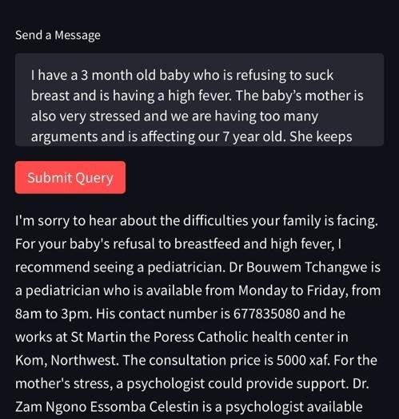

# Medical Assistant CMR

## Overview
This project is a medical assistant chatbot named Bati. It is designed to respond to medical queries and provide relevant information. The chatbot uses the GPT-4 model from OpenAI for natural language processing and understanding.

<div style="display: flex; justify-content: space-around;">
    
    
</div>

## Features
- Answers only medical queries: The assistant is designed with guardrails and system prompts to ensure it only responds to medical queries.
- Adds specialist info if available for medical queries: If a query is related to a specific medical specialty, the assistant will provide information about relevant specialists.
- Returns specialist info from data repository: The assistant retrieves information about medical specialists from a data repository, ensuring the information provided is accurate and up-to-date.

## Usage
To use the chatbot, simply run the command below and type your query into the text area and click the "Submit Query" button. The chatbot will then process your query and provide a response.

```streamlit run app.py```

## Development
This project was developed using Python and the Streamlit library for the web interface. The chatbot uses the OpenAI API for natural language processing.

## Future Improvements
Future improvements to this project could include adding more detailed responses, improving the error handling, and expanding the range of queries the chatbot can respond to.
